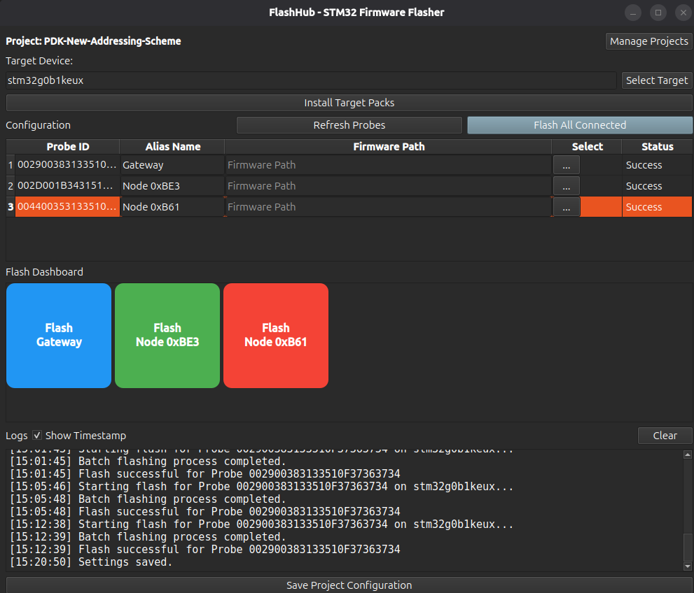

# FlashHub - STM32 Production Flasher

> **⚠️ Alpha Release Notice**  
> This tool is currently in **alpha phase** and under active development. Features may change, and bugs are expected. We welcome your feedback!  
> Feel free to:
> - 🐛 [Open an issue](../../issues) to report bugs or request features
> - 🍴 Fork the repository to experiment with changes
> - 🔧 Submit a Pull Request with improvements or updates

FlashHub is a helper GUI tool designed for production environments to flash firmware to multiple STM32 microcontrollers simultaneously. Built with PyQt6 and pyOCD, it provides a robust, user-friendly interface for managing multiple ST-Link probes with different firmware configurations.



## Key Features

- 🔍 **Automatic Probe Detection**: Instantly detects all connected ST-Link probes (V2, V3, etc.)
- 📦 **Per-Probe Configuration**: Assign unique firmware and alias names to each probe
- 🎨 **Visual Flash Dashboard**: Large, colorful square buttons for quick one-click flashing
- 🔄 **Parallel Flashing**: Flash multiple devices simultaneously with independent progress tracking
- 💾 **Project Management**: Save and switch between multiple project configurations
- 🎯 **Target Pack Manager**: Built-in pyOCD pack installer for STM32 device support
- 📊 **Real-Time Progress**: Individual progress bars and status for each probe
- 🕐 **Timestamped Logs**: Optional timestamps with clear button for log management
- 🔒 **Single Instance**: Prevents multiple app instances to avoid conflicts

## Installation

### Python Virtual Environment Setup

#### Linux/macOS

1. **Clone the repository**:
   ```bash
   git clone <repository-url>
   cd FlashHub
   ```

2. **Create a virtual environment**:
   ```bash
   python3 -m venv venv
   ```

3. **Activate the virtual environment**:
   ```bash
   source venv/bin/activate
   ```

4. **Install dependencies**:
   ```bash
   pip install -r requirements.txt
   ```

5. **Install USB drivers (if needed)**:
   - Ubuntu/Debian: `sudo apt-get install libusb-1.0-0`
   - Fedora/RHEL: `sudo dnf install libusb`
   - macOS: Install via Homebrew: `brew install libusb`

#### Windows

1. **Clone the repository**:
   ```cmd
   git clone <repository-url>
   cd FlashHub
   ```

2. **Create a virtual environment**:
   ```cmd
   python -m venv venv
   ```

3. **Activate the virtual environment**:
   ```cmd
   venv\Scripts\activate
   ```

4. **Install dependencies**:
   ```cmd
   pip install -r requirements.txt
   ```

5. **Install ST-Link drivers**:
   - Download and install [ST-Link USB drivers](https://www.st.com/en/development-tools/stsw-link009.html) from STMicroelectronics

## Quick Start Guide

### 1. Launch the Application

```bash
# Make sure virtual environment is activated
source venv/bin/activate  # Linux/macOS
# or
venv\Scripts\activate     # Windows

# Run the application
python3 main.py
```

### 2. Initial Setup

1. **Install Target Packs** (First time only):
   - Click "Install Target Packs"
   - Search for your STM32 family (e.g., "STM32G0", "STM32F4")
   - Click "Install" for the required pack

2. **Select Target Device**:
   - Click "Select Target" to browse supported devices
   - Or manually type the device name (e.g., `stm32g071rb`, `stm32f407`, `stm32u585`)

### 3. Configure Probes

1. **Connect ST-Link Probes**: Plug in your ST-Link programmers with connected target boards

2. **Refresh Probes**: Click "Refresh Probes" button

3. **Configure Each Probe**:
   - **Alias Name**: Give each probe a meaningful name (e.g., "Motor Controller", "Display Board")
   - **Firmware Path**: Click "..." to browse and select the `.hex`, `.bin`, or `.elf` file for that specific probe
   - Each probe can have a **different firmware** file

4. **Save Configuration**: Click "Save Project Configuration"

### 4. Flash Devices

You have two options:

#### Option A: Flash Individual Device (Dashboard)
- Scroll to the **Flash Dashboard** section
- Click the large colored button for the specific device you want to flash
- Watch the progress in the table

#### Option B: Flash All Devices
- Click "Flash All Connected" to flash all probes with valid firmware configurations
- All devices will flash in parallel

### 5. Monitor Progress

- **Status Column**: Shows "Ready", "Flashing...", "Success", or "Failed"
- **Progress Bars**: Display real-time flashing progress for each device
- **Logs**: View detailed operation logs (toggle timestamps with checkbox)

## Project Management

### Creating Multiple Projects

FlashHub supports multiple projects for different production lines:

1. Click "Manage Projects"
2. Click "New Project" and enter a name
3. Configure probes and firmware for this project
4. Switch between projects as needed

**Use Cases**:
- Different product variants with different firmware
- Testing vs Production configurations
- Multiple production lines

## Advanced Features

### Under-Reset Connection Mode

FlashHub uses `connect_mode="under-reset"` for robust connections. This helps when:
- Target MCU is in low-power sleep mode
- GPIO pins have been reconfigured (SWD pins reassigned)
- Target is unresponsive

### Error Handling

Common errors and solutions:

| Error | Cause | Solution |
|-------|-------|----------|
| Debug power error (11) | Target not powered | Check power supply and VRef connection |
| Target not found | Wrong target name | Use "Select Target" to choose correct device |
| Pack not installed | Missing device pack | Install pack via "Install Target Packs" |
| Firmware file not found | Invalid path | Browse to correct firmware file |

### Keyboard Shortcuts

- **Ctrl+S**: Save project configuration (auto-prompts for project name)
- **Escape**: Close dialogs

## Configuration Files

### config.json

Project configurations are saved in `config.json`:

```json
{
  "projects": [
    {
      "name": "Production Line A",
      "target_device": "stm32g071rb",
      "probes_config": {
        "066DFF515150717867093825": {
          "alias": "Motor Controller",
          "firmware": "/path/to/motor_fw.hex"
        },
        "066CFF343632534E43172157": {
          "alias": "Display Board",
          "firmware": "/path/to/display_fw.hex"
        }
      }
    }
  ],
  "current_project_index": 0
}
```

## Troubleshooting

### Linux Permissions

If you get USB permission errors:

```bash
# Create udev rule for ST-Link
sudo tee /etc/udev/rules.d/99-stlink.rules > /dev/null <<EOF
SUBSYSTEMS=="usb", ATTRS{idVendor}=="0483", ATTRS{idProduct}=="3748", MODE="0666"
SUBSYSTEMS=="usb", ATTRS{idVendor}=="0483", ATTRS{idProduct}=="374b", MODE="0666"
SUBSYSTEMS=="usb", ATTRS{idVendor}=="0483", ATTRS{idProduct}=="374e", MODE="0666"
EOF

# Reload udev rules
sudo udevadm control --reload-rules
sudo udevadm trigger

# Unplug and replug your ST-Link
```

### Virtual Environment Not Activating

If `source venv/bin/activate` doesn't work:
- Use `. venv/bin/activate` instead
- Or use full path: `source /path/to/FlashHub/venv/bin/activate`

## System Requirements

- **OS**: Linux, Windows 10/11, macOS 10.15+
- **Python**: 3.8 or higher
- **RAM**: 512 MB minimum
- **USB**: USB 2.0 ports for ST-Link probes
- **Hardware**: ST-Link V2, V2-1, or V3 programmers

## Dependencies

- **PyQt6**: Modern Qt6 bindings for Python GUI
- **pyOCD**: Open-source ARM Cortex-M debugger and programmer

## License

[Add your license here]

## Contributing

[Add contribution guidelines here]

## Support

For issues or questions:
- Check the logs with timestamps enabled
- Verify target pack is installed
- Ensure target board is powered
- Check ST-Link firmware is up to date
